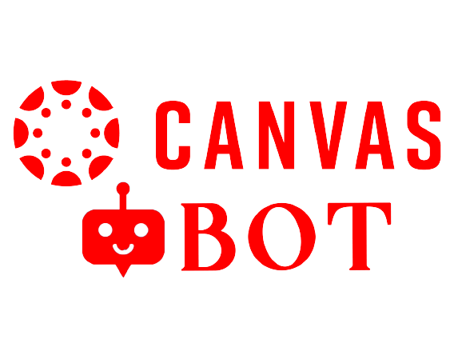

# Description:
This is an automated bot especially made for Students of Canvas Instructure.
It Collects your data based on your schedule then it automatically attends the classes.

# Legal Disclaimer:
Developers assume no liability and are not responsible for any misuse or damage caused by this program. 
This purely use for educational purposes only.

### Coded : @The-Robin-Hood https://github.com/The-Robin-Hood/

# How Does it Work
1. Initially when the program run for the first time. It collects the neccessary data.
2. These where stored locally as json file "UserInfo.json".
3. With the help of the information the program when initiated it automatically login and  attends the particular Class based on your schedule.
4. When Class is been initiated , terminated or if the class didn't get started within the time.   You get a message through Telegram. 
5. You can also Restart, Terminate and shutdown via telegram

# Telegram Integration
1. For the telegram integration, You should contain telegram account. Then Create a telegram Bot 
      Visit: https://sendpulse.com/knowledge-base/chatbot/create-telegram-chatbot
2. Note Down the Access token.(Example: 1139263225:AAF8XgrgvmtKAD8GdRgg10sY94Co_Yw411U) This is BOT ID.
3. Now We need to get the Chat ID of your account,First send message to Your Bot. Then Visit this URL. https://api.telegram.org/botXXX:YYYYY/getUpdates  (Replace the XXX: YYYYY with your BOT HTTP API Token you just got from the Telegram BotFather)
4. You may find "chat":{"id":XXXXXXX,first_name= YY}.Note down ChatID:XXXXXXX
5. Now you have BotID and ChatID.Which is asked when program runs for the first time.

# Requirements & Installation
1. Python3 (Python2 not supported)
2. Chrome Driver or FireFoxDriver (Recommended:ChromeDriver)
  ->Windows : Download and Extract it to C://Windows/System32 (or) to whatever environmental PATH 
    https://chromedriver.storage.googleapis.com/90.0.4430.24/chromedriver_win32.zip
  -> Linux : apt install chromedriver
3. Now install packages selenium and request 
   -> pip install selenium
   -> pip install requests
   -> pip install num2words

# Usage:
python3 CanvasBot.py

# Contributing:
1. Fork it (https://github.com/The-Robin-Hood/CanvasBot/fork)
2. Create your feature branch (git checkout -b feature/fooBar)
3. Commit your changes (git commit -am 'Add some fooBar')
4. Push to the branch (git push origin feature/fooBar)
5. Create a new Pull Request
 Contributors are Welcomed
